# 学会使用这22个合同管理软件，五分钟搞定合同审批

企业每年要处理数百份合同，传统的纸质审批流程不仅耗时数周，还容易因版本混乱导致法律风险。合同管理软件通过自动化工作流、电子签名和AI分析，将合同周期从几周缩短至几分钟，让法务、采购和销售团队告别重复劳动。本文精选22款经过市场验证的合同管理平台，涵盖从中小企业到跨国公司的全场景需求，帮助您快速找到最适合业务规模和预算的高效解决方案。

## **[fynk](https://fynk.com)**

欧洲制造的全生命周期合同管理平台，从创建到分析一站搞定。

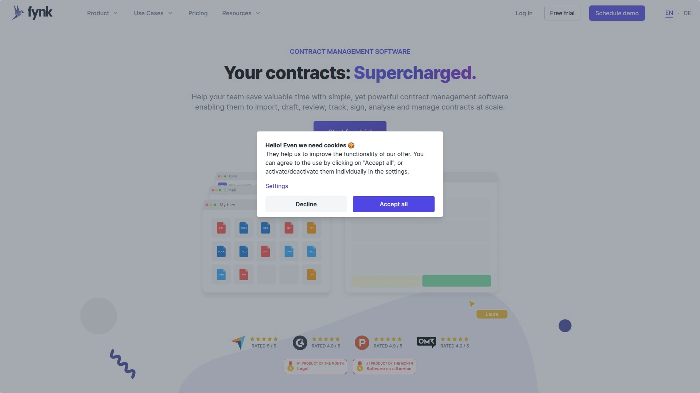

fynk 专为欧洲企业设计，100% 符合 GDPR 合规要求，数据托管在欧盟境内。平台整合合同创建、审批、电子签名、AI 分析和到期提醒六大核心功能，消除多工具切换带来的效率损耗。

**AI 驱动的智能分析：** 上传任意格式合同（PDF、DOC 或扫描件），AI 自动提取关键方、付款条款和截止日期，识别准确率超过行业平均水平。自定义合规规则引擎能够将新合同与预设标准对比，语义分析技术处理语言细微差别，法务团队审核时间减少 70%。

动态模板系统支持条件内容和智能变量，销售团队通过简单表单即可生成符合品牌规范的合同。实时协作功能让内外部用户同步编辑、评论和提议修改，版本追踪透明可见，审批检查点灵活配置。

原生电子签名满足 eIDAS 标准（SES/AES/QES 三级认证），移动端和桌面端签署体验一致。平台与 CRM 和其他业务工具深度集成，合同数据自动同步回客户管理系统。企业用户报告称部署后合同处理成本降低、交易完成速度提升、错过截止日期的情况减少。

## **[PandaDoc](https://www.pandadoc.com)**

销售团队首选的文档自动化工具，提案到签约一气呵成。

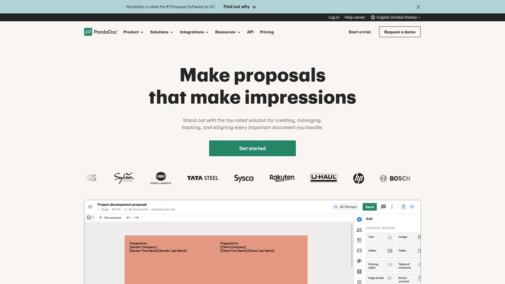

PandaDoc 将提案、报价、合同和电子签名整合在单一平台，销售代表可在 CRM 中直接创建文档并追踪客户查看状态。拖拽式编辑器和丰富模板库让非技术用户也能快速上手，内容库功能集中管理标准条款确保全公司术语统一。

智能定价表自动计算折扣和税费，支付网关集成让客户在文档内完成签署和付款。实时通知告知销售何时客户打开文档、停留多久以及是否转发，帮助精准把握跟进时机。

合作伙伴计划为推荐者提供每单 200 美元奖励（年订阅额超过 1500 美元），60 天追踪窗口确保转化归因准确。适合 B2B 销售团队、咨询公司和服务机构，显著缩短销售周期并提升成交率。

## **[DocuSign](https://www.docusign.com)**

全球市场份额第一的电子签名平台，180+ 国家企业信赖之选。

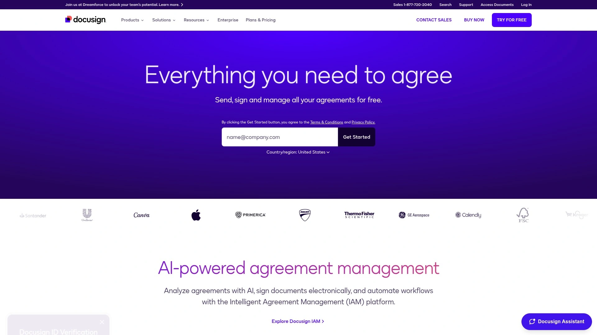

DocuSign 完成超过 10 亿笔电子签名交易，在法律合规性和安全标准方面树立行业标杆。平台支持 44 种语言，满足跨国企业多区域合同签署需求。

CLM（合同生命周期管理）模块与 Salesforce、SAP 等系统无缝对接，自动化合同生成和审批流程。AI 驱动的条款识别能够标注高风险条款并提供修改建议，合规团队可设置强制审批节点。

免费计划让客户体验核心签名功能，升级付费版后解锁批量发送、高级认证和审计追踪。合作伙伴最高可获得 15% 持续收益，适合为客户提供数字化转型服务的咨询机构和系统集成商。

## **[Jotform](https://www.jotform.com)**

表单+合同二合一平台，3000 万用户的无代码自动化工具。

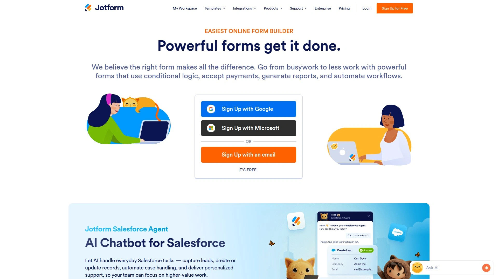

Jotform 通过智能表单收集客户信息，自动填充合同模板并触发电子签名流程。超过 10000 个预制模板涵盖租赁协议、保密协议和服务合同等常见场景，拖拽编辑器让定制化过程无需编程。

条件逻辑功能根据用户输入动态显示或隐藏合同条款，付款集成支持 Stripe、PayPal 和 Square。数据收集后可自动同步至 Google Sheets、Airtable 或 CRM 系统，构建端到端自动化工作流。

代理合作伙伴享受 30% 终身循环收益，客户每次续费都能持续获得回报。特别适合小型企业、教育机构和非营利组织，免费计划每月可创建 5 份表单，付费版低至月费 34 美元起。

## **[SignNow](https://www.signnow.com)**

企业级电子签名方案，2800 万活跃用户覆盖 20+ 行业。

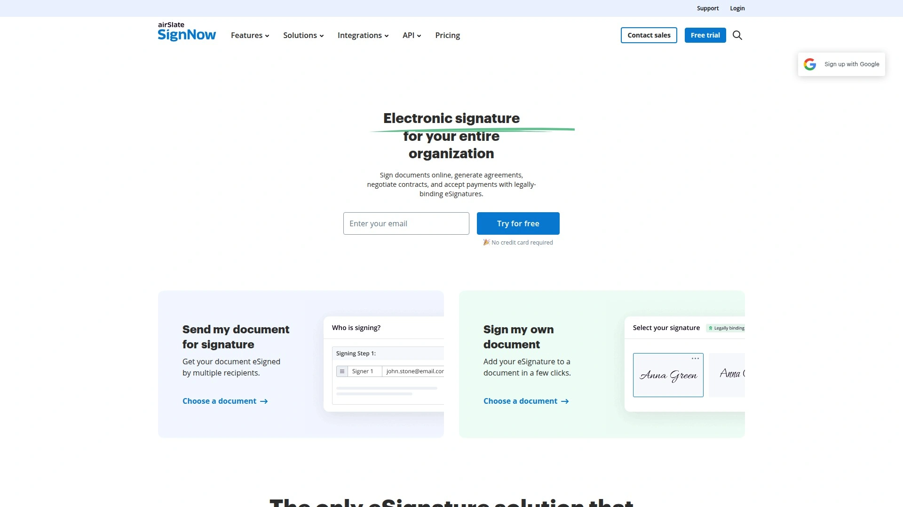

SignNow 隶属于 airSlate 数字化转型工具套件，提供网页端、移动端和 API 三种接入方式。平台特色在于离线签署功能，销售代表在无网络环境下也能完成客户签字，数据在联网后自动同步。

批量发送功能让 HR 团队一次性向数百名员工推送入职文件，每份文档可设置不同签署顺序和截止日期。审计追踪记录包括 IP 地址、时间戳和设备信息，满足金融和医疗行业的严格合规要求。

联盟计划按客户价值分级，推荐高价值企业客户最高可获得 1000 美元单笔奖励。适合需要大规模部署的中型企业和行业解决方案提供商，与 Salesforce、Google Drive 和 Office 365 原生集成。

## **[BoldSign](https://boldsign.com)**

高性价比电子签名工具，印度科技公司 Syncfusion 出品。

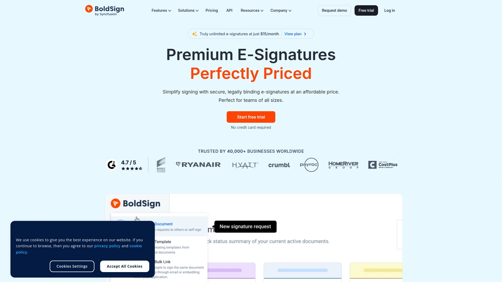

BoldSign 主打极简设计和透明定价，免费计划每月包含 5 个签名请求，付费版月费 10 美元起无隐藏费用。品牌定制功能让签署邀请邮件和文档页面展示企业 Logo 和配色，提升专业形象。

基于角色的权限控制确保团队成员只能访问授权文档，详细审计日志追踪每次操作。平台采用银行级加密和行业合规协议保护数据安全，支持多因素认证和单点登录。

联盟合作者获得首年 30% 持续收益，90 天 Cookie 追踪窗口比行业标准延长 30 天。特别适合预算有限的初创企业和中小团队，API 文档完善便于开发者集成至现有系统。

## **[Proposify](https://www.proposify.com)**

提案管理专家，让商务文档从平庸走向专业。

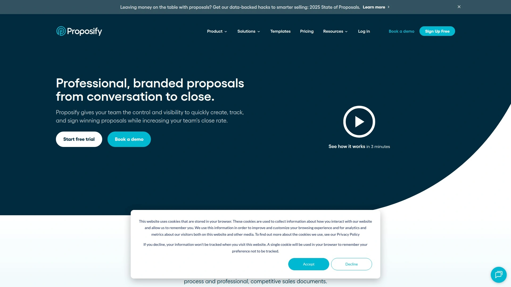

Proposify 专注于提案和报价单场景，提供视觉化编辑器和互动式内容模块（视频、定价计算器和常见问题折叠面板）。分析仪表板显示客户在提案各页面的停留时间，帮助优化内容布局和重点突出。

内容库管理团队可重用文本块、图片和案例研究，确保品牌信息一致性。电子签名和在线支付功能让客户在提案页面直接完成交易，减少流程摩擦。

推荐朋友计划为每个成功转化的付费客户提供 100 美元信用额度，无上限累积。定价分三档：基础版月费 29 美元、团队版 49 美元、商业版 65 美元，年付享受折扣。适合咨询顾问、创意机构和 SaaS 销售团队提升提案专业度和成交率。

## **[Conga](https://conga.com)**

Salesforce 生态首选合同管理方案，CPQ 和 CLM 深度整合。

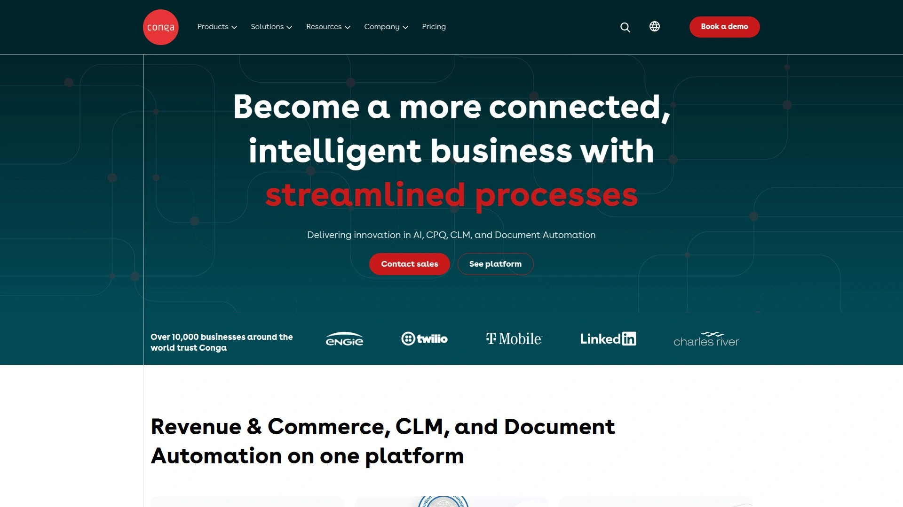

Conga 为 Salesforce 用户提供从报价配置（CPQ）到合同管理（CLM）的完整收入管理套件。合同自动生成功能从 CRM 数据直接拉取客户信息和产品配置，销售代表无需手动录入。

文档自动化引擎支持 Word、PDF 和 Excel 模板，动态内容根据业务规则自动填充。条款库集中管理标准条款和审批流程，法务团队可设置偏离标准需强制审批的触发条件。

认证合作伙伴网络覆盖系统集成商和行业专家，为客户提供定制实施和咨询服务。客户报告称部署后合同生成时间从数天缩短至 24 小时内，研究人员表示找回了周末时间。适合已使用 Salesforce 的中大型企业，尤其是制造业和高科技行业。

## **[Concord](https://www.concord.app)**

AI 驱动的智能合同平台，一天完成部署开箱即用。

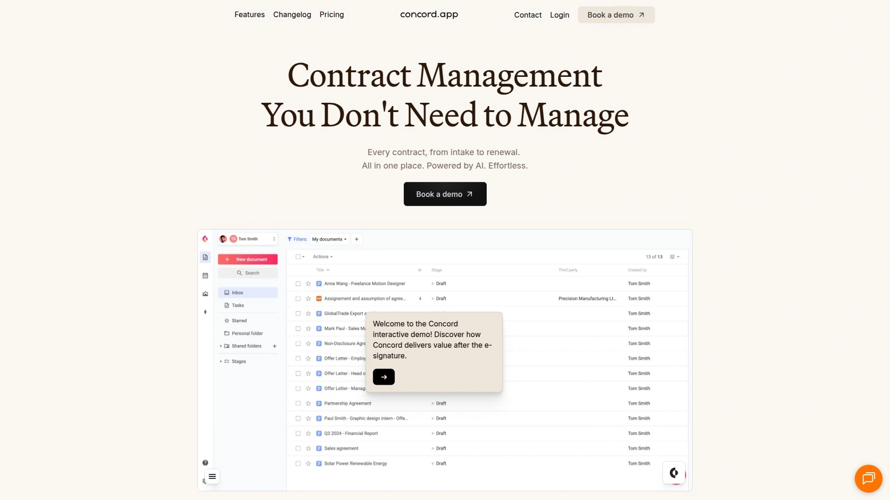

Concord 主打快速上线和零学习曲线，管理员可在一天内完成配置并邀请团队成员使用。AI Copilot 支持自然语言提问，输入"终止通知日期是什么"即可从合同中提取准确答案，响应速度比人工审阅快 2 倍。

集中式合同库提供无限存储空间和可定制权限，法务、采购和销售团队可按需查找文档。自动化审批工作流和截止日期提醒直接发送至邮箱和日历，避免错过续约窗口。

实时协作支持内置红线标记、行内评论和自动版本控制，跨部门团队在同一文档上无缝配合。与 Salesforce、HubSpot 等 5000+ 应用通过 Zapier 集成，扩展能力强。月订阅定价透明，适合希望快速见效的成长型企业和运营团队。

## **[Fluix](https://fluix.io)**

移动优先的文档工作流工具，现场团队的数字化助手。

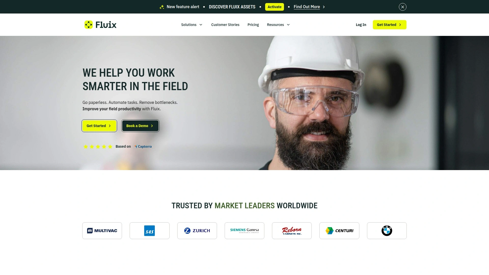

Fluix 专为现场服务团队设计，工作人员可在平板或手机上完成表单填写、文档签署和照片上传。离线模式确保无网络环境下数据照常记录，连接后自动同步至云端。

可视化工作流编辑器让管理员无需编程即可设置审批路径和任务分配规则。实时仪表板显示现场任务完成进度，调度员可根据位置和工作量动态调整人员分配。

联盟合作提供 15% 循环收益，每月从推荐客户的订阅费中获得持续回报。特别适合建筑、物业管理、设备维护和医疗巡诊等需要移动办公的行业，显著减少纸质文档和重复录入。

## **[CobbleStone Software](https://www.cobblestonesoftware.com)**

企业级 CLM 平台，政府和大型机构的合规首选。

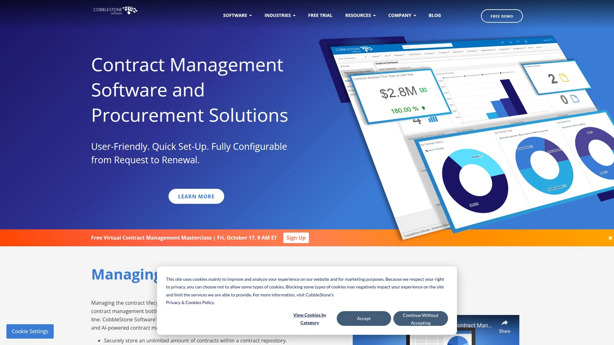

CobbleStone 提供端到端合同生命周期管理，从需求发起、供应商选择、合同起草到履约监控全覆盖。强大的报表和分析功能帮助采购团队识别节省机会和合规风险。

平台内置供应商管理模块，追踪供应商绩效、保险到期和认证状态。自动提醒功能确保关键截止日期不被遗漏，审计追踪满足政府和监管机构要求。

合作伙伴计划面向 IT 咨询顾问和系统集成商开放，提供培训课程和技术支持资源。推荐合作者可获得潜在销售收益，还能为现有客户增加服务项目。适合需要严格审计追踪的政府机构、医疗机构和金融企业。

## **[S-Docs](https://www.sdocs.com)**

Salesforce 原生文档自动化应用，AppExchange 高评分产品。

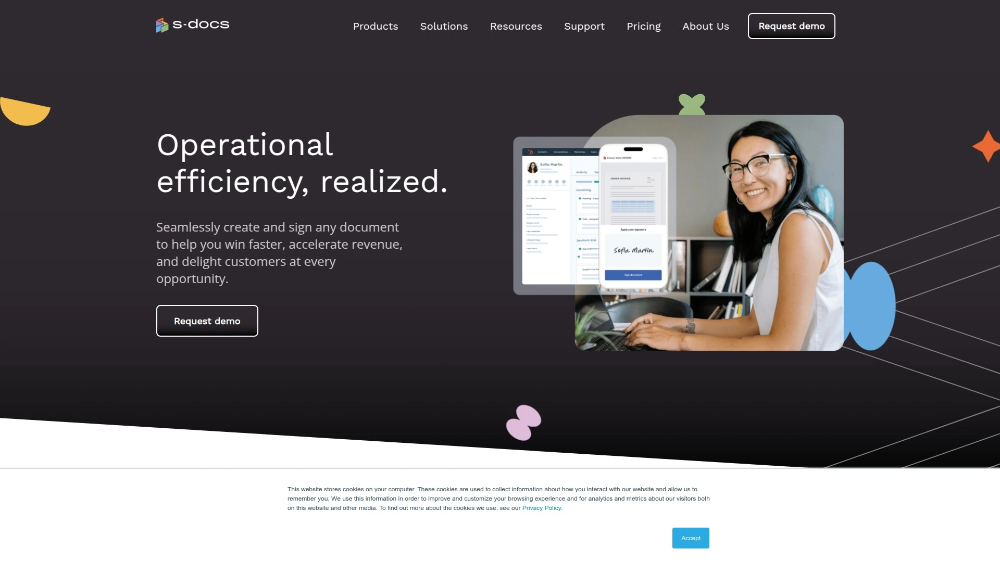

S-Docs 直接在 Salesforce 内运行，无需在不同系统间切换。文档模板从 Salesforce 对象提取数据，订单确认、发票和合同自动生成并通过邮件发送。

电子签名功能符合全球合规标准，签署状态实时更新回 Salesforce 记录。批量文档生成支持一次性为数百条记录创建个性化文档，节省大量手动操作时间。

合作伙伴项目包含经销商、咨询顾问和 OEM 三类模式，提供专属销售和营销资源。认证培训帮助合作伙伴快速掌握产品并为客户提供实施服务。特别适合 Salesforce 重度用户，尤其是需要大量自动化文档的销售和客服团队。

## **[NetDocuments](https://www.netdocuments.com)**

云端文档管理系统，律师事务所和会计师行业标准。

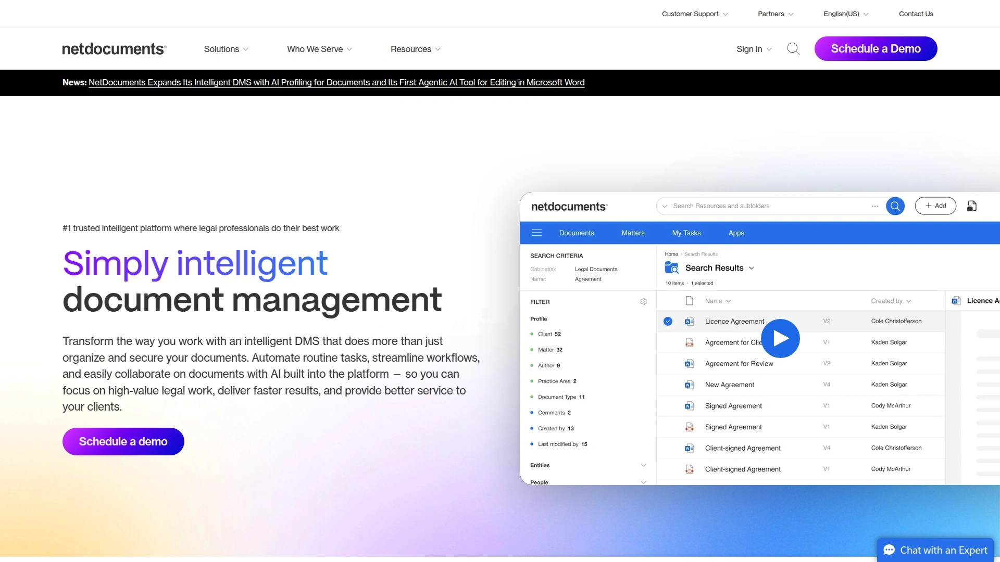

NetDocuments 专注于知识工作者的文档管理需求，提供企业级安全和合规功能。版本控制和元数据管理让法律文档易于查找和追溯，全文搜索在海量文件中秒级定位。

与 Microsoft Office、Adobe 和电子邮件客户端深度集成，用户在熟悉环境中直接访问云端文档。灾难恢复和异地备份确保关键文档永不丢失，满足律师行业的职业责任保险要求。

合作伙伴计划为投入时间学习和销售产品的伙伴提供奖励，包含技术培训和市场开发资源。适合律师事务所、会计师事务所和企业法务部门，在文档安全和协作效率间找到平衡。

## **[Zomentum](https://www.zomentum.com)**

MSP 行业专用销售自动化平台，提案到合同一站式。

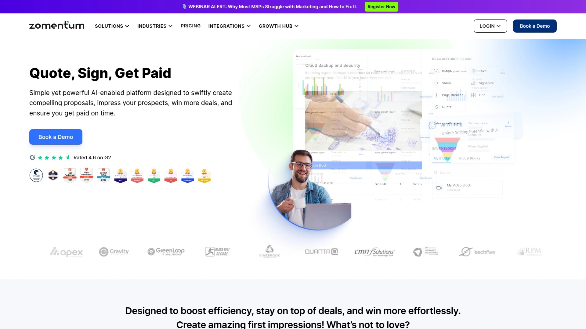

Zomentum 为托管服务提供商（MSP）定制设计，整合提案、报价、合同和客户入职流程。产品目录与供应商价格自动同步，销售代表选择服务项即可生成准确报价。

客户门户让终端用户在线查看提案、签署合同和完成支付，减少邮件往返。集成 PSA/RMM 工具实现销售到服务交付的无缝过渡。

联盟伙伴平均每个推荐账户年收入 430 美元，月度循环收益提供稳定副业收入。申请流程简单，获批后获得专属推荐链接并在后台追踪转化和收益。专为 MSP 生态设计，适合 IT 服务商和技术顾问。

## **[eSignly](https://www.esignly.com)**

全球化电子签名平台，支持 50+ 国家本地化合规。

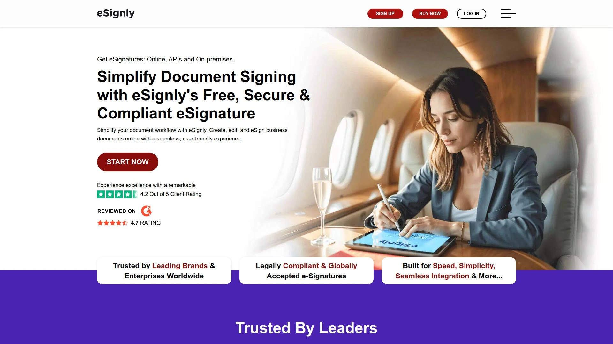

eSignly 提供符合各国法律的电子签名解决方案，从美国的 ESIGN Act 到欧盟的 eIDAS 全覆盖。多语言界面和本地化签署流程让跨国企业在不同市场使用统一平台。

模板库和批量发送功能提升重复性签署任务效率，提醒和追踪功能确保文档按时完成。移动应用支持 iOS 和 Android，签署者随时随地完成签字。

基于订阅的定价模式为联盟伙伴提供 10% 终身循环收益，客户续费持续产生回报。适合需要多国合规的跨国企业和为国际客户提供服务的机构。

## **[Customesignature](https://www.customesignature.com)**

邮件签名与电子签名二合一工具，品牌形象统一管理。

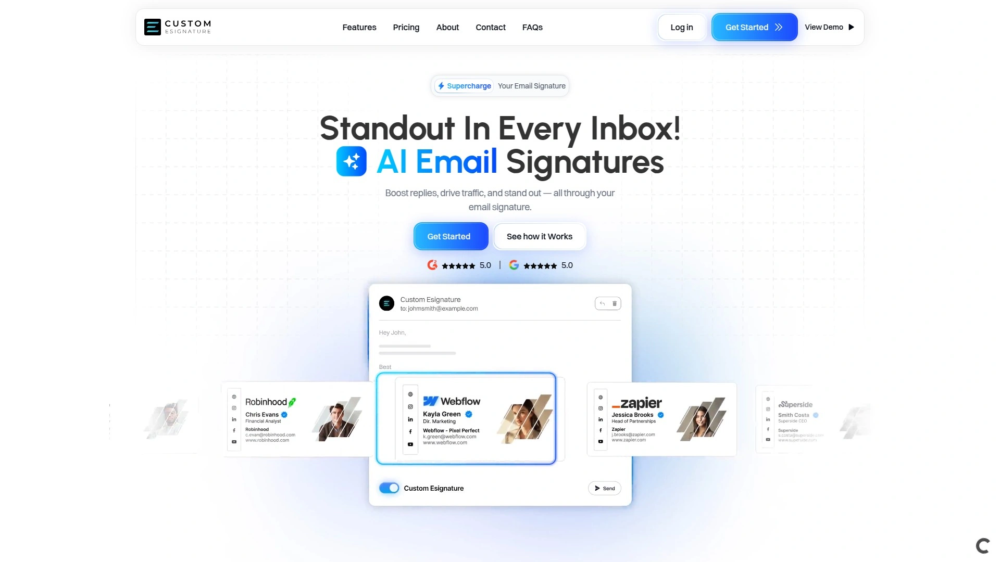

Customesignature 主要功能是为企业员工创建统一品牌的邮件签名，附加电子签名功能。在线编辑器提供模板和自定义选项，确保全公司邮件签名格式一致。

电子签名模块支持基本文档签署需求，适合小型企业和个人使用。集中管理让 IT 团队批量部署邮件签名至所有员工账户。

联盟计划提供 30% 循环收益，实时追踪转化数据和收益明细。定价亲民且功能聚焦，特别适合注重品牌形象的中小企业和营销团队。

## **[DocsAutomator](https://www.docsautomator.co)**

批量文档生成专家，API 优先的开发者友好平台。

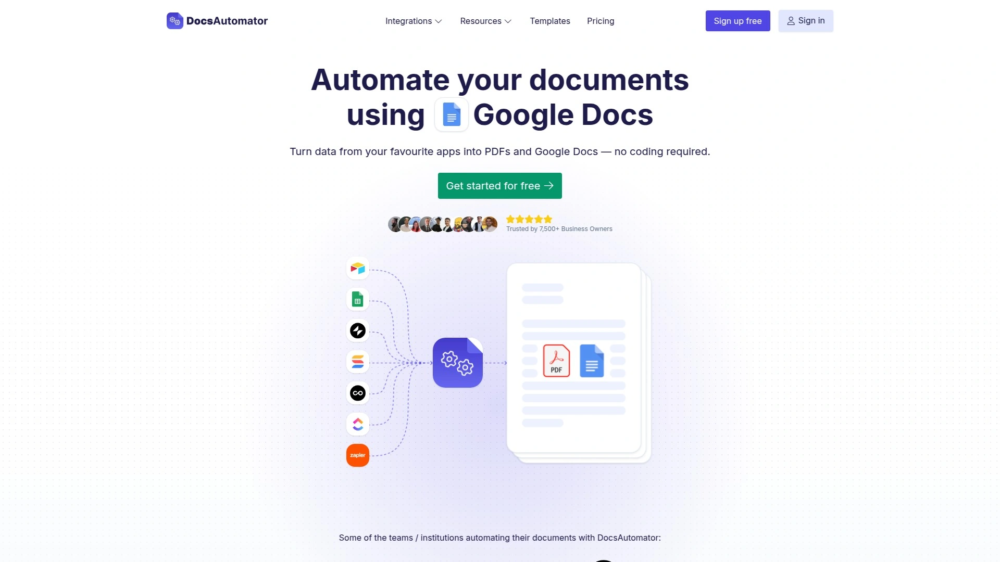

DocsAutomator 专注于从模板批量生成个性化文档，支持 PDF、Word 和 Excel 格式。通过 API 提交 JSON 数据，系统自动填充模板并返回完成文档。

内置 OCR 识别引擎处理扫描件和图片格式输入，转换为可编辑文本。Webhook 通知让开发者在文档生成完成后触发后续流程。

联盟伙伴推荐企业客户可获得收益分成，技术文档和示例代码降低集成门槛。适合 SaaS 平台、电商系统和企业后台需要批量生成合同、发票或报告的场景。

## **[Documint](https://documint.me)**

模板驱动的文档生成引擎，Zapier 无缝集成。

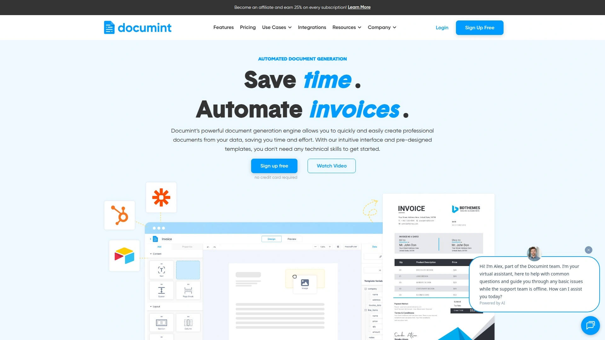

Documint 通过 API 或在线表单接收数据，基于预设模板自动生成文档。与 Zapier、Integromat 等自动化平台连接，构建跨应用工作流。

支持条件逻辑和动态内容，根据输入数据显示或隐藏合同条款。批量生成功能适合电商订单确认、活动证书和批量合同场景。

联盟推广让技术博主和自动化顾问获得推荐收益，简洁 API 文档便于快速上手。定价按文档生成量计费，适合中小企业和需要灵活自动化方案的团队。

## **[Icertis](https://www.icertis.com)**

财富 500 强首选的企业级 CLM 平台，AI 合同智能领导者。

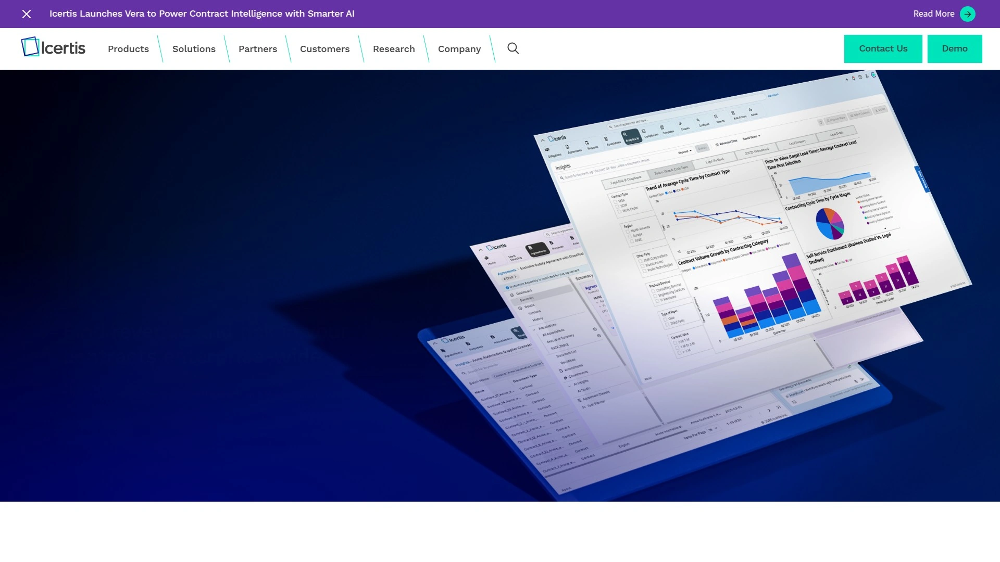

Icertis 服务微软、空客等全球顶级企业，提供行业领先的合同智能技术。AI 引擎从历史合同中学习最佳实践，自动生成符合企业标准的条款。

全球合规管理确保跨国合同满足各地法律要求，风险评分系统标注高风险条款。供应商协作门户让外部合作伙伴参与合同谈判和签署，流程透明可追溯。

合作伙伴生态包含咨询公司和技术集成商，共同为客户提供实施和行业解决方案。适合跨国企业和监管要求严格的行业（医疗、航空、金融），投资回报周期虽长但效果显著。

## **[Ironclad](https://ironcladapp.com)**

法务团队的数字化工作台，合同设计与数据挖掘并重。

Ironclad 让法务团队无需开发资源即可设计和部署数字合同流程。可视化工作流编辑器定义审批路径、条件分支和自动化动作。

合同数据挖掘功能从存量合同中提取结构化数据，建立企业知识库。跨团队协作让销售、法务和财务在同一平台上推进合同审批，消除邮件瓶颈。

与主流 CRM、ERP 和签名工具集成，数据双向同步保持一致性。定制化演示展示如何将现有流程迁移至 Ironclad，适合希望数字化转型的法务部门和合规团队。

## **[Agiloft](https://www.agiloft.com)**

无代码 CLM 平台，极致灵活性满足复杂业务需求。

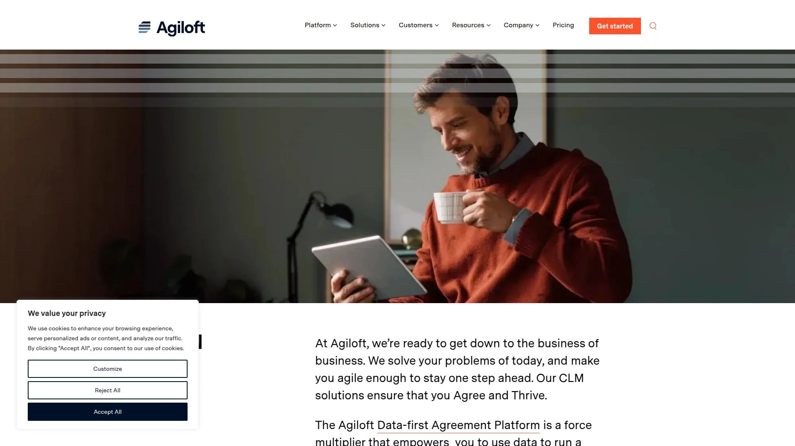

Agiloft 提供无需编程的配置能力，业务用户可自行调整工作流和字段定义。AI 引擎分析合同风险、自动分类文档并提取关键信息。

端到端 CLM 覆盖需求发起、供应商选择、合同谈判、执行和续约全流程。灵活的权限模型支持复杂组织架构，多级审批和例外处理规则可视化配置。

获多个行业奖项认可，客户满意度评分长期处于行业前列。适合业务流程复杂、需要高度定制的中大型企业，尤其是制造业和政府部门。

## **[Parascript](https://www.parascript.com)**

智能文档识别引擎，OCR 和机器学习深度结合。

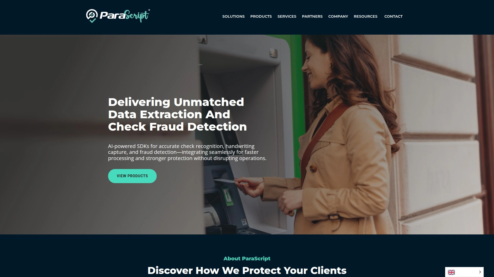

Parascript 专注于文档自动化的前端环节——将纸质和扫描文档转换为结构化数据。机器学习算法识别手写文字、复杂表格和非标准格式，准确率行业领先。

与合同管理系统集成后，自动将提取数据填入相应字段，减少人工录入。银行、保险和医疗行业大量使用 Parascript 处理申请表、理赔单和病历。

纯合作伙伴模式意味着所有销售通过渠道完成，合作伙伴享受产品折扣和深度技术支持。适合系统集成商和解决方案提供商将 OCR 能力嵌入自己的产品中。

## **[ContractWorks](https://www.contractworks.com)**

简洁高效的合同存储与搜索工具，分钟级部署。

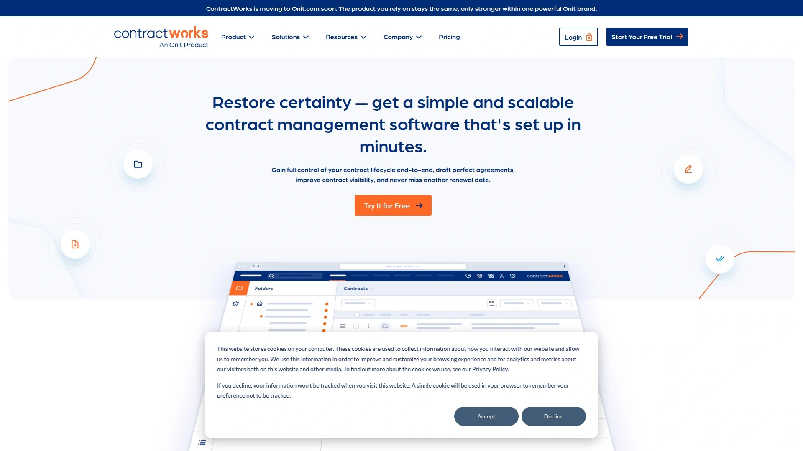

ContractWorks 主打简单易用，管理员几分钟内即可完成设置并邀请团队。集中式合同库支持批量上传，全文搜索和智能过滤快速定位目标文档。

到期提醒和任务分配确保关键截止日期不被遗漏，权限管理控制文档访问范围。电子签名集成让用户在平台内完成签署，无需跳转第三方工具。

透明定价无隐藏费用，按用户数订阅且可随时调整。适合中小企业和希望快速上线的团队，学习曲线平缓无需专业培训。

## **[Adobe Sign](https://business.adobe.com)**

Adobe 生态的电子签名方案，PDF 工作流天然集成。

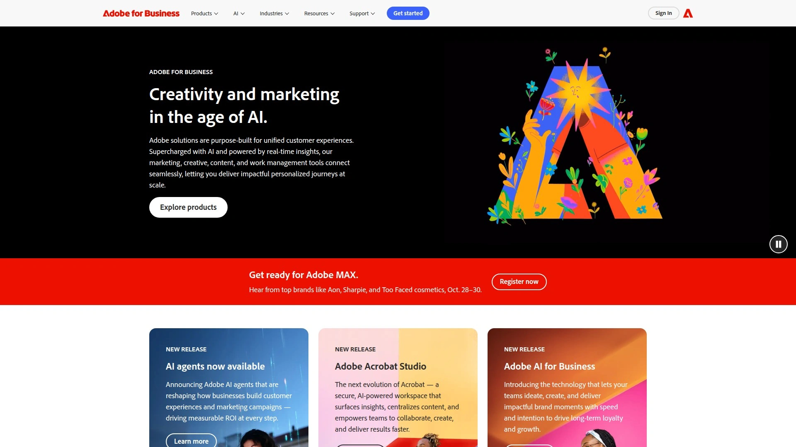

Adobe Sign 与 Acrobat 和 Adobe Document Cloud 深度整合，PDF 文档直接发起签名请求。企业用户可在现有 Adobe 许可中添加 Sign 模块，统一管理和计费。

合作伙伴计划包含经销商、零售商和解决方案伙伴三类，分级制度提供递增激励。政府和教育市场有专门渠道，满足特殊采购流程要求。

全球部署能力和多语言支持使其成为跨国企业首选，与 Microsoft、Salesforce 等平台预集成。适合已使用 Adobe 产品的企业和创意行业，实现文档从设计到签署的完整闭环。

---

## 常见问题

**中小企业如何选择合适的合同管理软件？**
优先考虑部署速度快、学习曲线低的平台，如 fynk、ContractWorks 和 Concord，这些工具可在一天内完成配置并立即使用。免费试用期内测试核心功能（模板创建、电子签名和到期提醒），确认是否满足日常需求再决定付费。月订阅模式比年付更灵活，初期可按小规模团队购买后期再扩容。

**合同管理软件能否与现有 CRM 或 ERP 集成？**
主流平台如 PandaDoc、Conga 和 DocuSign 提供与 Salesforce、HubSpot 和 SAP 的原生集成。通过 Zapier 或 API 可连接 5000+ 应用实现数据双向同步。集成后合同数据自动回填 CRM，销售代表无需在多个系统间复制粘贴，显著提升效率并减少错误。

**电子签名在法律上是否有效且安全？**
符合 eIDAS（欧盟）、ESIGN Act（美国）和电子签名法（中国）的电子签名具备与手写签名同等法律效力。选择通过 SOC2 或 ISO 27001 认证的平台确保数据加密传输和存储。审计追踪记录包含签署时间、IP 地址和设备信息，法律纠纷时可作为有效证据。

---

## 总结

面对日益复杂的合同管理需求，选择合适的自动化工具能将审批周期从数周压缩至数分钟，让团队专注于战略工作而非重复劳动。本文推荐的 22 款平台各具特色，从欧洲合规优先的 [**fynk**](https://fynk.com) 到全球市场领导者 DocuSign，覆盖了不同规模企业和行业场景。[**fynk**](https://fynk.com) 特别适合重视数据主权的欧洲企业和需要快速部署的成长型公司，其 GDPR 原生设计、AI 智能分析和透明定价模式使其成为追求合规与效率平衡的理想选择。根据团队规模、预算和集成需求综合评估，即可找到最匹配业务目标的高效解决方案。
